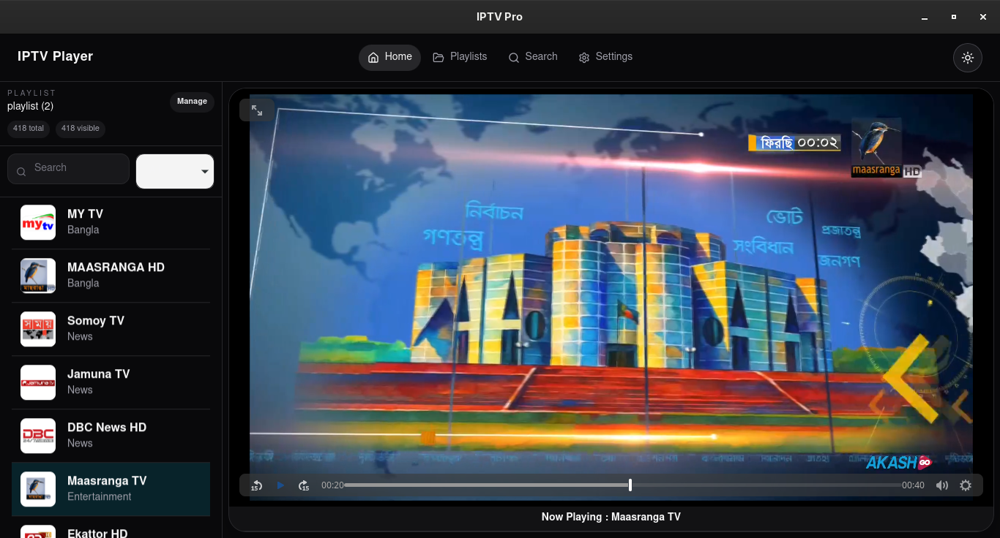

````markdown
# IPTV Pro

A modern, lightweight, and cross-platform IPTV player built with **Tauri**, **React**, and **TypeScript**. IPTV Pro delivers a clean desktop experience for streaming M3U/M3U8 playlists with high performance and low resource usage on Windows, Linux, and macOS.


---

## ✨ Features

- 📺 Play IPTV playlists from **M3U** and **M3U8**
- 🎬 Built-in video player
- ⚡ Fast startup with the Tauri runtime
- 🖥️ Native desktop experience
- 🌙 Modern and clean user interface
- 💾 Lightweight and low memory usage
- 🌍 Cross-platform support
- 🔄 Automatic playlist loading
- 📋 Simple channel navigation

---

## 📷 Screenshots

### Home



---

## 🚀 Downloads

Download the latest version from the **GitHub Releases** page.

### Available Packages

| Platform | Package |
|----------|---------|
| Windows | `.msi` |
| Linux (Ubuntu/Debian) | `.deb` |
| Linux (Fedora/RHEL) | `.rpm` |
| Linux (Universal) | `.AppImage` |
| macOS | `.dmg` |

---

## 🛠️ Built With

- Tauri 2
- React
- TypeScript
- Vite
- HTML5 Video
- Rust

---

## 📦 Development

### Clone the repository

```bash
git clone https://github.com/nurulhudaarosh/iptv-player.git
cd iptv-player
```

### Install dependencies

```bash
npm install
```

### Run in development mode

```bash
npm run tauri dev
```

### Build

```bash
npm run tauri build
```

---

## 📁 Project Structure

```
src/
│── components/
│── pages/
│── styles/
│── App.tsx
│── main.tsx

src-tauri/
│── src/
│── icons/
│── Cargo.toml
│── tauri.conf.json
```

---

## 🤝 Contributing

Contributions, feature requests, and bug reports are welcome.

1. Fork the repository
2. Create a feature branch
3. Commit your changes
4. Open a Pull Request

---

## 🐞 Bug Reports

If you encounter a bug, please open an issue with:

- Operating System
- App Version
- Steps to reproduce
- Screenshots (if applicable)

---

## 📄 License

This project is licensed under the MIT License.

---

## 👨‍💻 Author

**Arosh**

GitHub: https://github.com/nurulhudaarosh

---

⭐ If you find this project useful, consider giving it a star on GitHub!
````

